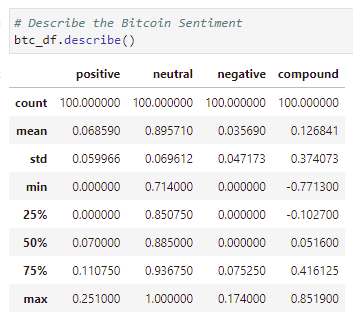

<h1 align="center">Assignment Unit 12 - Sentiment Analysis</h1>

    
        
        <section> <b>By: Ebad Salehi </b> </section>

  

————————————————————————
 
<!-- TABLE OF CONTENTS -->

  
 <b>Table of Contents</b>

  <ul>
        <li><a href="#fetch">Fetch the News</a></li>   
        <li><a href="#NLP">NLP</a></li> 
        <li><a href="#NER">NER</a></li> 
        <li><a href="#files">Code (.ipynb)</a></li> 
        <li><a href="#tech">Technologies Used</a></li>    
  </ul>

————————————————————————

 

<h2> Overview </h2>

    
<h3>Section 1: Fetch the News Articles</h3>    
    
Using the <a href="https://newsapi.org/"> newsapi</a> to fetch the latest news articles for Bitcoin and Ethereum, we can create a DataFrame of <b>Sentiment Scores</b> for each coin. Then using <u>Descriptive Statistics</u> to answer some questions.

        
>You need to have your "NEWS_API_KEY" stored in `.env` file to run the code on your >local computer.
 
Ploting the Bitcoin and Ethereum Headlines Sentiment Chart:
<section align="center">    
    
    
    
</section>    
    
(<a href="#top">↥ back to top</a>)

 

    
<h3>Section 2: Natural Language Processing (NLP)</h3>
   <li>Tokenizer: Using NLTK and Python to tokenize the text for each coin.</li>
   <li> NGrams and Frequency Analysis: looking at the ngrams and word frequency for each coin.</li>      <li>Word Clouds: Generating word clouds for each coin to summarize the news for each coin.</li>
   <section align="center">    
        
                
    </section>    

(<a href="#top">↥ back to top</a>)

 

    
<h3>Section 3: Named Entity Recognition (NER)</h3>
    
 building a NER model for both Bitcoin and Ethereum, then visualizing the tags using SpaCy.
  
 <section align="center">    
        
          
                
    </section>       

(<a href="#top">↥ back to top</a>)
  

 

<h2> Files </h2>
    
Find the code in `.ipynb` format (Jupyter-Lab notebook):
    
[Crypto Sentiment](Codes/crypto_sentiment.ipynb)

 

	
<h2> Technologies Used: </h2>
	
   - NLTK
   - matplotlib  
   - Pandas
   - Python
   - API     
   - Jupyetr notebook

(<a href="#top">↥ back to top</a>)

 
